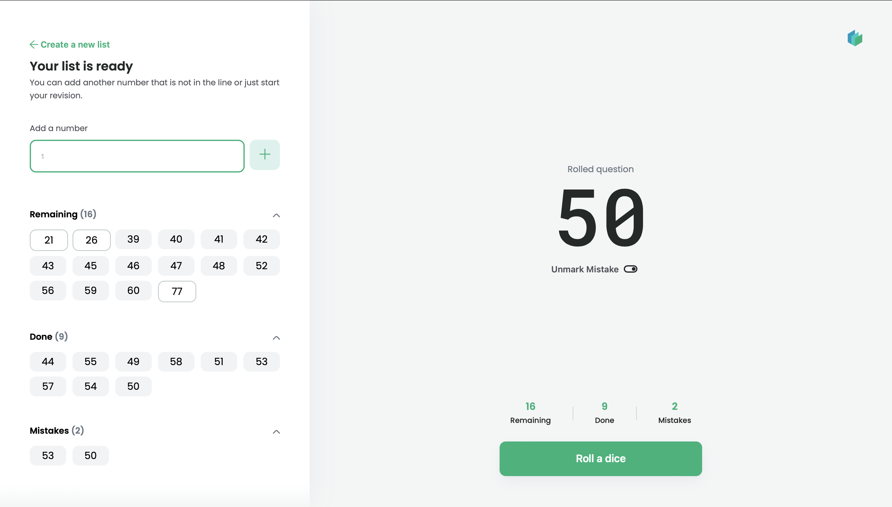

# Repetitio - React & Redux App

## Enhance your knowledge

[Live Version](https://repetitio.me).

When I was studying for university exams, I lack the tool to effectively randomize my questions list. So I decided to build this app. :)
This app is also my final portfolio project required at Codecademy's Front-End Engineer carreer path which I attended.

## Preview

## Technologies

- React & Redux
- React Router
- HTML, CSS, JavaScript

## Features

- Generate a list of numbers from 1 to 200.
- After that you can still add individual questions to your list.
- All the time you have perfect overvies of Remaining and Done questions + Mistakes list.
- If you are not satisfied about your knowledge within particular question, you can mark it as a mistake and come back to it later.
- When you are done with repeating, you can create a new list from your mistakes or just create a whole new list.
- Mobile, Tablet and Desktop responsive
- React Routing responsivity (= while you are repeating on the desktop and then suddenly change width of your screen, you will be redirected to different Route path).
- Shadows under navbar are also sensitive to changing width of the screen.

## Future

- I would like to develop Repetitio further more in the future.
